# Homework

## Analysis Views {.tabset}

### API Features (week 7)

  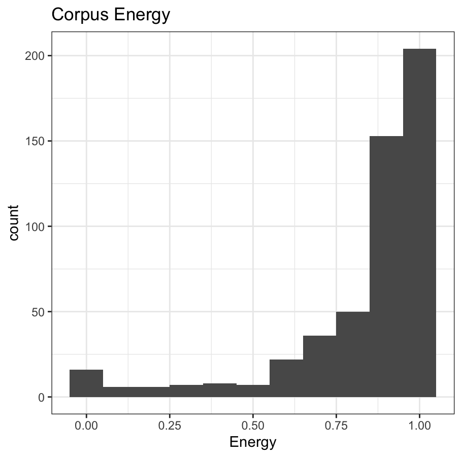 

The first histogram here is a visualisation of the full corpus in terms of energy. The corpus I've compiled is a collection of four progressive metal bands' (Gojira, TOOL, Meshuggah, and Dir En Grey) entire discographies, and the aim of this portfolio is to display differences in musicality depending on region. Gojira is progressive metal band founded in France, TOOL is American, Meshuggah is from Sweden, and Dir En Grey is Japanese. The irony of the French band having a Japanese name and the Japanese band having a French name is not lost on me. The histogram above displays the variation in energy as measured by Spotify's API. I chose this specific Spotify API feature because progressive metal (like most subgenres of metal) is known for its high-energy tracks, and some other features (such as acousticness) will likely not show much variation.

### Chromagrams (week 8)

  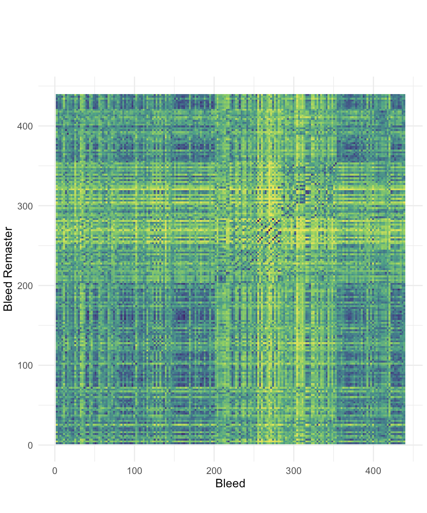 

The chromagram I've done for this assignment compares the 2008 original release of the song *Bleed* by Swedish progressive metal band Meshuggah with the band's 15th anniversary remaster of the same song, released on the remastered version of the album *Obzen* in 2023. Here, we can see the 2023 version (displayed on the y axis) and the original 2008 version (displayed on the x axis) of *Bleed* are similar, though the exact mixing and timing differs somewhat. The black diagonal line can be viewed, starting at about 250 seconds, shows similarity in both chromagrams, displaying points in time where the remaster did not differ from the original. Euclidean normalisation was used for this chromagraph comparison. I chose these specific tracks from Meshuggah because they are a particularly notable incidence of a remaster displaying differences in pitch from the original.

### Cepstrograms (week 9)

 
   
  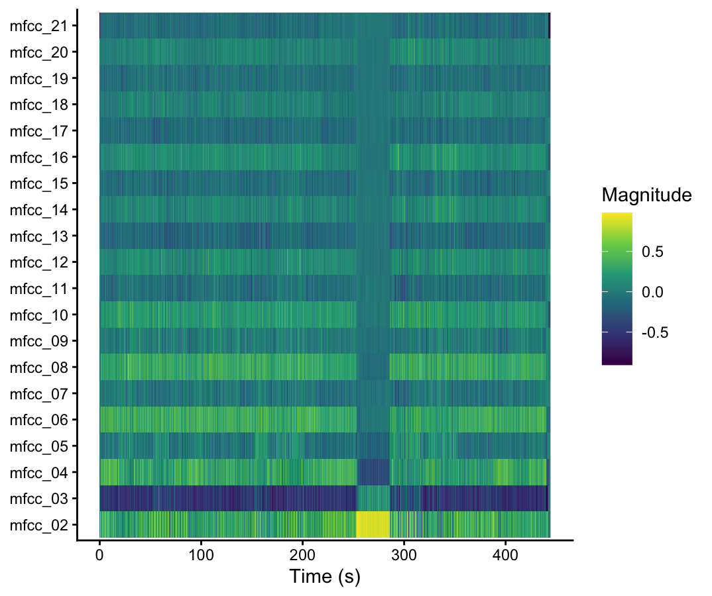 

.

As you can see, the cepstrogram for the 2008 original recording of *Bleed* by Meshuggah has a long instrumental section that ends just before the 300 second mark, causing a visible difference in timbre on the cepstrogram. This instrumental section uses less distortion than other areas within the piece and has a much softer sound, which comes across as extreme when contrasted with the high-distortion, intense guitar and percussion through the rest of the piece.

This cepstrogram for the 2023 remaster of *Bleed* by Meshuggah is very similar to the cepstrogram of the original recording, though measurement of timbre in the instrumental section before the 300 second mark appears slightly more extreme here, highlighting an increase in the difference of timbre with the 2023 version's mixing. Both this and the previous cepstrogram use Euclidean normalisation rather than Manhattan or Chebyshev, as those methods of normalisation, I found, provided the best visual display of variance in timbre.

### Self-Similarity Matrices (week 9)

 
   

I've also provided a self-similarity matrix for the 2023 remaster of *Bleed*, where the difference in timbre during the instrumental section is even more visible. In this self-similarity matrix, the song structure of *Bleed* is even more visible. I chose this track because of its distinctive instrumental section. While most of the track is characterised by intense, highly-technical and fast-tempo guitarwork, this instrumental segment starting at 4 minutes and 11 seconds is atmospheric, slow-paced, and uses reverb in a way the rest of the track doesn't. Instrumental, highly experimental segments like these are common in progressive metal, and I found *Bleed* to be a very visible example of this feature of the genre.

### Keygrams (week 10)

 
  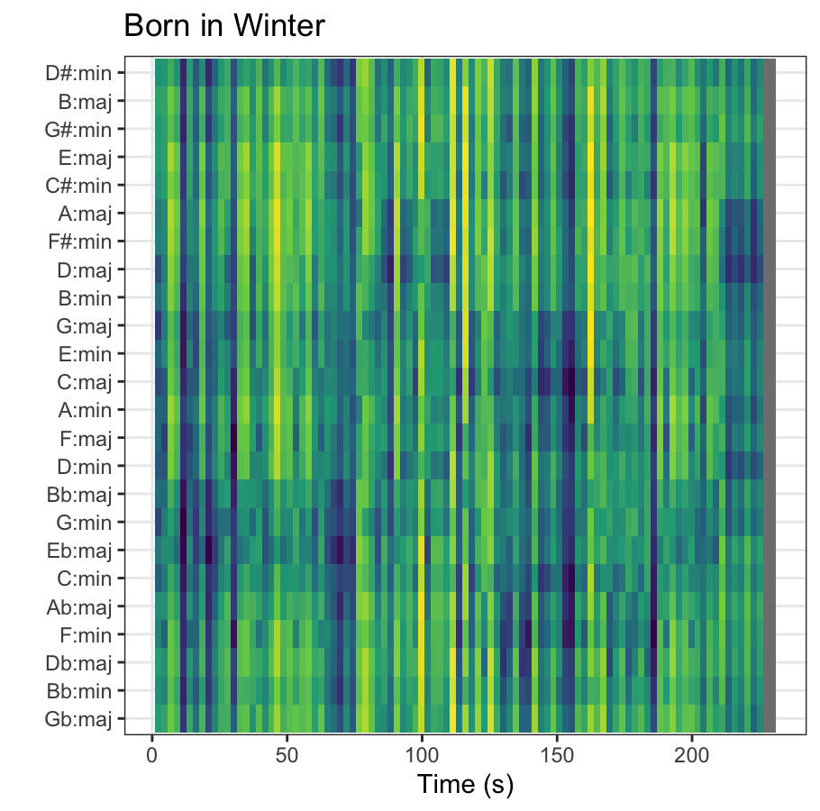 

Above is a keygram for Gojira's song *Born in Winter*. I've chosen *Born in Winter* because it is one of Gojira's more atmospheric tracks, showing deliberate drift away from distinct keys, and use of modes in a pretty typical manner to progressive metal, though the energy of the track itself is far lower than the average progressive metal song. There are some distinct tonal centres at 25 and 75 seconds in around Eb major, with further distinct tonal clustering at 150 seconds around C major, and to a lesser degree, F minor. This lack of consistent key or mode fits with the broader atmospheric, drifting quality of *Born in Winter*, and is an example of deviation from traditional Western notions of key that is common in the progressive metal genre.

<!-- ### Tempo + Novelty (week 11) -->

<!-- 
 -->
<!--   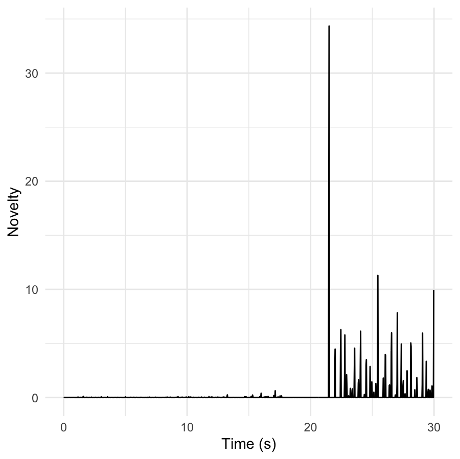 -->
<!--   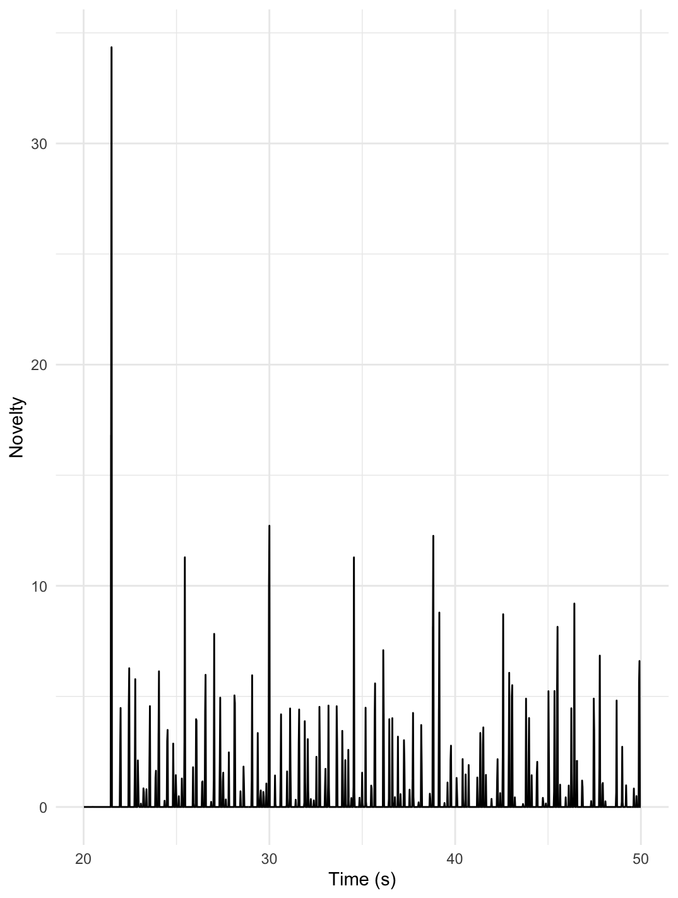 -->
<!-- 
 -->

<!-- (1) As you can see, this novelty function has a period of almost 30 seconds where no tempo is detected at all. Intolerance begins with a long period of near silence before picking up at around 21 seconds, which explains why the visualisation did not have any data to depict before that point. -->
<!-- (2) Here is an adjusted novelty function beginning at 20 seconds and ending at 50 seconds into the track, instead of the previous one, that covered the period of the first 30 seconds. After this, the tempo seems much more regular... at a glance. Complications arise later in the track, as the meter undergoes changes from 4/4 to 3/4 and then back again. It'll be easier to explain what I mean with the DFT tempogram. -->
<!-- (3) DFT strongly points to 280 BPM, which is uncommon for electronic tracks. therefore, it must be double time with the actual tempo lying around 140 BPM.  -->

### Novelty (week 11)

 
   
   

<!--  -->

As you can see, this novelty function has a period of almost 30 seconds where no onsets are detected at all. *Intolerance* by TOOL begins with a long period of near silence before picking up at around 21 seconds, which explains why the visualisation did not have any data to depict before that point.

<!--  -->

Here is an adjusted novelty function beginning at 20 seconds and ending at 50 seconds into the track, instead of the previous one, that covered the period of the first 30 seconds. After this, the tempo seems much more regular... at a glance. Complications arise later in the track, as the meter undergoes changes from 4/4 to 3/4 and then back again. It'll be easier to explain what I mean with the DFT tempogram.

### Tempo (week 11)

 
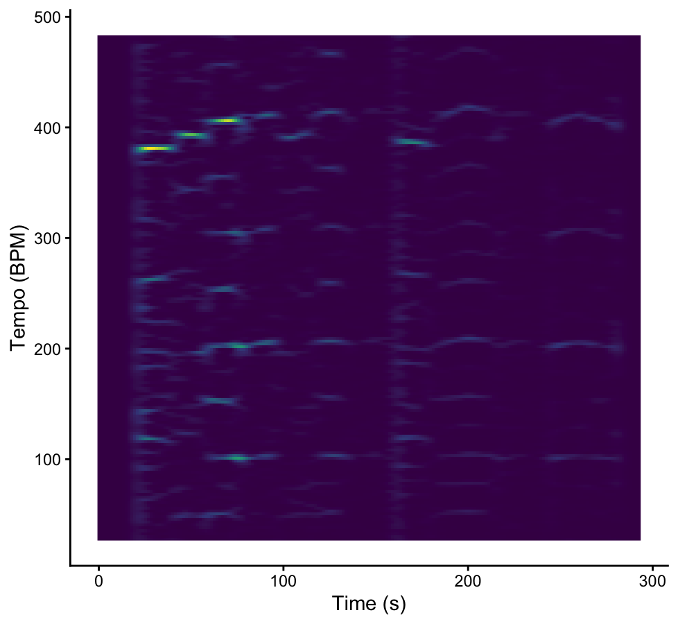

Here, we can see evidence of a meter change at about 175 seconds, which happens during an instrumental bridge. Meter changes and tempo changes are very common among the progressive metal genre (of which *Intolerance* is an early example), but can be somewhat problematic for visualisations of tempo that often rely on a standard, stable meter. *Intolerance* is a particularly difficult track to count beats in when listening ordinarily, which is why I've chosen it as an example here. *Bleed* by Meshuggah, an example used for earlier weeks, is similar in genre, but its beats map more cleanly to 4/4 and can be more easily counted by the average listener. This tempo visualisation of *Intolerance* tracks an uptick in BPM at around the time of the first verse, which, when listening to the track, doesn't seem to match up. However, if the tempo is measured by the beat of the bass rather than percussion, that would make some sense, as the bass begins playing on beats 1 and 4 or 1 and 3 of each measure rather than playing in smaller subdivisions.

### Dendrograms (week 12)

 
  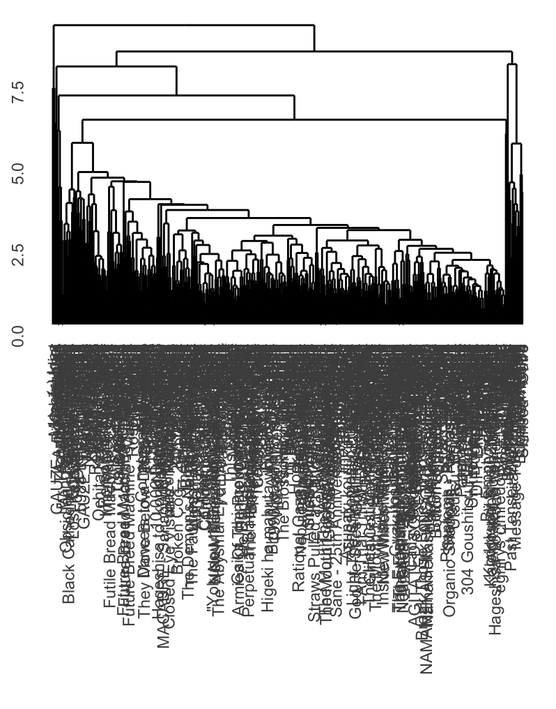 
  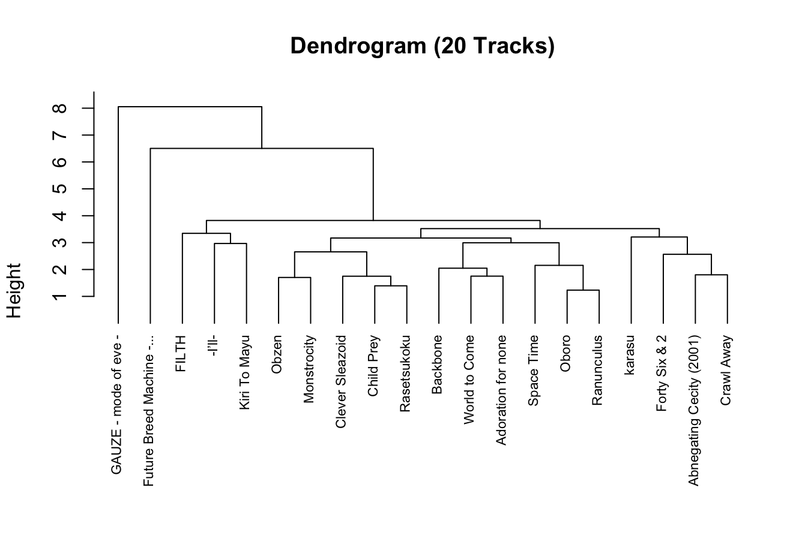 

As you can see, this first dendrogram is completely illegible due to the high number of data points, although the clustering is still clearly visible. I've created a second dendrogram with 20 randomly selected tracks from the corpus to better display how the specific tracks are clustered.

This second dendrogram does a much better job displaying how the songs are clustered within the dataset, though it utilises a much smaller sample than the original (only 20 tracks, versus the entire corpus, which contains 515 tracks). This shows clearer clustering of tracks by Dir En Grey when compared to other progressive metal bands' tracks. Some tracks, though, are still notable outliers and are clustered far later than the others. Examples of this would be *Gauze - mode of eve* by Dir En Grey, which is notable for its short duration and low energy, both of which set it apart the other tracks in this random selection from the corpus. *Future Breed Machine - Campfire Version* by Meshuggah is another outlier, due to the fact that it is an acoustic recording of more traditional, less-acoustic progressive metal Meshuggah song *Future Breed Machine*. *Obzen* by Meshuggah and *Monstrocity* by Meshuggah are examples of songs by the same band that are highly similar across nearly every category, but particularly the *Speechiness* and *Tempo* categories. *Child Prey* by Dir En Grey and *Rasetsukoku* by Dir En Grey are also highly similar across *Energy* and *Instrumentalness* categories, hence their close clustering. This will be even more visible in this week's heatmaps.

### Heatmaps (week 12)

 
  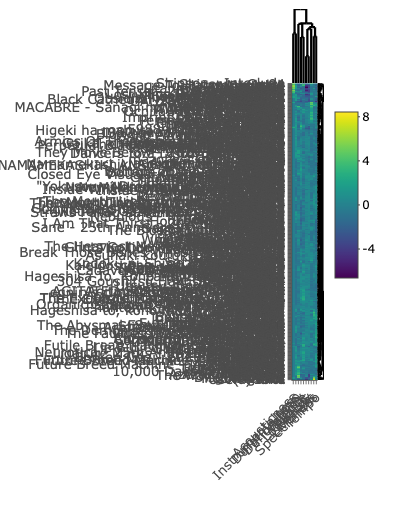 
  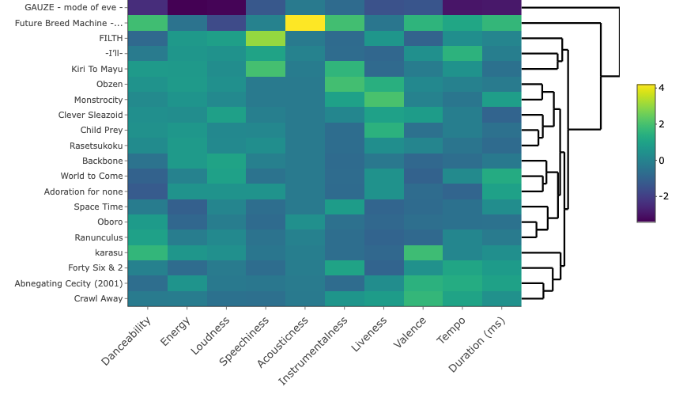 

This first heatmap suffers from the same problem as the first dendrogram - too much text, not enough spacing. I've used the same solution (a 20-track sample of the corpus, rather than a display of the corpus in its entirety) for the second heatmap.

This second heatmap is much more legible, and here we can begin to see clear differences between tracks in the corpus. The *Acousticness* category shows the least variation, with one notable highly acoustic exception being *Future Breed Machine - Campfire Version* by Meshuggah. Additionally, *Gauze - mode of eve*, the final track to Dir En Grey's 1999 album *GAUZE*, is an outlier in nearly every respect, though most notably for its track length. While most tracks across this corpus range from 1 to 15 minutes, *Gauze - mode of eve* is only 4 seconds long. 
